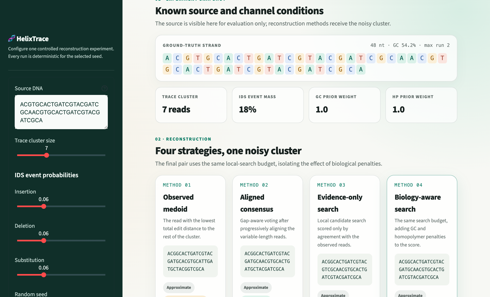
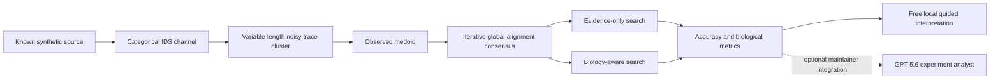

# HelixTrace

**Biology-aware reconstruction for noisy DNA storage reads.**

HelixTrace is an interactive, reproducible workbench that turns one synthetic DNA strand into a
cluster of reads with insertion, deletion, and substitution (IDS) errors, reconstructs the hidden
strand with four transparent methods, and tests whether GC-content and homopolymer rules are useful
decoding priors.

The complete public application is free to run: it requires no OpenAI account, API key, credits, or
paid service. GPT-5.6 Sol was used through Codex to build and validate the Build Week extension. An
optional maintainer-enabled Responses API analyst remains available as a separate integration.



The scientific result is intentionally modest and useful: on constraint-compliant sources, adding
the biological prior made **100% of outputs biologically valid**, versus **85%** for an equal-budget
evidence-only search, while both recovered exactly **32.5%** of strands. A negative control shows the
prior can be actively harmful when the encoder did not guarantee those constraints.

## Benchmark result

The committed benchmark contains 120 constraint-compliant experiments: 60 nt sources, 20 samples
in each combination of cluster size `3/5/10` and symmetric per-event IDS probability `0.03/0.06`.
Every method saw the same trace clusters.

| Method | Exact recovery | Mean normalized edit distance | Biologically valid outputs |
|---|---:|---:|---:|
| Observed trace medoid | 1.7% | 0.08948 | 64.2% |
| Alignment consensus | 27.5% | 0.04430 | 80.8% |
| Evidence-only local search | **32.5%** | 0.03669 | 85.0% |
| Biology-aware local search | **32.5%** | **0.03657** | **100.0%** |

The 20-source GC negative control is the important guardrail: evidence-only search achieved 55%
exact recovery, while biology-aware search achieved 0%. A biological prior is legitimate only when
the encoding process guarantees that the source follows it. These small results are descriptive,
not a claim of statistical significance or state-of-the-art performance. See
[the complete benchmark report](docs/benchmark.md) and the committed
[long-form results](artifacts/benchmark_rows.csv).

## What the app does

1. Simulates independent noisy copies through a validated categorical IDS channel.
2. Selects an observed medoid as a minimal baseline.
3. Globally aligns variable-length reads and builds an iterative gap-aware consensus.
4. Runs two equal-budget substitution searches from that consensus:
   - evidence-only, scored by mean Levenshtein distance to the reads;
   - biology-aware, adding soft GC and homopolymer penalties.
5. Reports exact recovery, edit distance, GC content, longest homopolymer, and validity.
6. Generates a deterministic guided interpretation of the verified metrics, including a verdict,
   reliability warning, and next experiment, entirely locally and at zero cost.
7. Optionally lets a maintainer-enabled GPT-5.6 integration interpret the same bounded evidence.



The known source is used only after reconstruction to calculate benchmark metrics. Reconstruction
methods receive the noisy reads, not the source sequence.

## Quick start

HelixTrace runs on macOS, Linux, and Windows with Python 3.11 or newer.

No OpenAI account, API key, credits, or paid service are needed for this path:

```bash
git clone https://github.com/772q5xpjpx-alt/helixtrace.git
cd helixtrace
python3 -m venv venv
source venv/bin/activate
python -m pip install --upgrade pip
python -m pip install -r requirements.txt
streamlit run app.py
```

On Windows PowerShell, activate with `venv\Scripts\Activate.ps1` instead.

### Optional maintainer integration

The public reconstruction experience is complete without the analyst. A maintainer who explicitly
wants to enable the optional Responses API extension can install its separate dependency and
configure a server-side key:

```bash
python -m pip install -e ".[ai]"
export OPENAI_API_KEY="your-key-here"
streamlit run app.py
```

The analyst uses the OpenAI Responses API with the `gpt-5.6` model. It receives only a bounded JSON
summary of precomputed experiment results. It does **not** reconstruct the sequence, invent metrics,
or turn this baseline into a neural model; its product role is to explain the evidence, flag limited
reliability, and recommend one concrete follow-up experiment. This optional code path is mock-tested;
its presence is not presented as evidence that a live API call occurred.

## Command line and reproducibility

Run one complete experiment:

```bash
helixtrace \
  --sequence ACGTACGTACGT \
  --cluster-size 5 \
  --insertion-probability 0.08 \
  --deletion-probability 0.08 \
  --substitution-probability 0.08 \
  --seed 42
```

Maintainers who installed the `ai` extra may add `--ai-analysis` when a server-side
`OPENAI_API_KEY` is configured. The default command remains complete and offline.

Reproduce all committed benchmark artifacts:

```bash
python scripts/run_benchmark.py \
  --samples-per-cell 20 \
  --sequence-length 60 \
  --seed 20260720 \
  --output-dir artifacts
```

Run the full verification suite:

```bash
pytest -q
ruff check .
ruff format --check .
```

## Four scientific guardrails

- **Controlled source assumptions:** compliant sources are generated at 45–55% GC with maximum
  homopolymer length 3, and a deliberately noncompliant negative control tests failure outside that
  assumption.
- **Uncoded scope:** this is an uncoded synthetic reconstruction study. It does not claim a
  like-for-like comparison with coded methods such as TrellisBMA.
- **Variable-length reconstruction:** insertions and deletions are handled by explicit global
  alignment before voting; raw sequence positions are never treated as already aligned.
- **Fair constraint ablation:** evidence-only and biology-aware searches start from the same
  consensus, use the same substitution neighborhood, and receive the same iteration budget.

## What did not work — and what this does not claim

- Biological penalties did **not** improve aggregate exact recovery over the equal-budget
  evidence-only control in this small benchmark; the useful measured change was output validity.
- The negative control demonstrates a severe failure when the prior is false.
- Center-star alignment is a deterministic heuristic, and repeated bases can still create ambiguous
  alignments.
- The simulator is categorical and synthetic. Its probabilities are per channel event, not directly
  interchangeable with published per-base nanopore error rates.
- There is no trained transformer, differentiable biological loss, real nanopore evaluation, or
  state-of-the-art claim in this release.

The longer-term research question remains: can the same GC and homopolymer ideas improve a neural
reconstructor when placed inside its differentiable training loss? This MVP establishes the tested
simulator, baselines, metrics, ablation, and negative control needed to investigate that question
honestly.

## Build Week extension and Codex collaboration

This repository began as a small personal research scaffold on **July 10, 2026**, before the OpenAI
Build Week submission period. The meaningful Build Week extension below was implemented on
**July 20, 2026**. The distinction is explicit:

| Before Build Week | Added during Build Week |
|---|---|
| Categorical IDS simulator | Levenshtein metrics and biological constraint metrics |
| Seeded trace-cluster generation | Deterministic global alignment, medoid, and iterative consensus |
| Initial CLI and 22 simulator tests | Equal-budget evidence-only and biology-aware local search |
| IDS channel semantics note | Controlled benchmark, negative control, and committed result artifacts |
| — | Streamlit product experience and browser-based visual QA |
| — | Optional GPT-5.6 Responses API experiment analyst |
| — | Expanded automated suite, submission documents, and demo script |

Codex, powered by GPT-5.6 Sol for this development task, was the primary engineering collaborator for
the Build Week extension. It audited the existing repository, checked the official requirements,
split independent implementation and review work, built the reconstruction and evaluation layers,
wrote deterministic tests, ran the benchmark, created the Streamlit experience, and exercised it in
a real browser. That last visual pass found and fixed an HTML rendering defect that unit tests had
missed.

The key product and scientific decisions remained explicit: prioritize a working, honest educational
experiment over an unfinished neural model; keep coded and uncoded reconstruction separate; compare
constraint-aware search against an equal-budget control; include a negative control; and describe the
current method as inference-time decoding, not differentiable training.

The verified GPT-5.6 use in this submission is GPT-5.6 Sol through Codex during development. The
repository also includes an optional Responses API analyst in
[`ai_analyst.py`](src/dna_trace_reconstruction/ai_analyst.py). That extension is separate from the
free public experience; all reconstruction and metric calculations remain deterministic, local, and
testable.

## Repository map

```text
.
├── app.py                              # Interactive Streamlit product
├── src/dna_trace_reconstruction/
│   ├── ids_channel.py                  # Validated categorical IDS simulator
│   ├── reconstruction.py               # Alignment, medoid, and consensus
│   ├── constraints.py                  # Biological metrics and equal-budget searches
│   ├── metrics.py                      # Levenshtein metrics
│   ├── pipeline.py                     # End-to-end experiment orchestration
│   ├── source_design.py                # Controlled source generator
│   └── ai_analyst.py                   # GPT-5.6 Responses API integration
├── scripts/run_benchmark.py            # Deterministic benchmark runner
├── artifacts/                          # Committed raw and aggregate results
├── tests/                              # Automated behavior and integration tests
├── docs/                               # Model semantics and benchmark report
├── SUBMISSION.md                       # Ready-to-paste hackathon copy
├── DEMO_SCRIPT.md                      # Under-three-minute recording script
└── HACKATHON_CHECKLIST.md              # Final delivery checklist
```

## Roadmap

1. Repeat the benchmark across more seeds and use uncertainty intervals.
2. Validate the channel and reconstruction methods on the CNR nanopore dataset.
3. Compare appropriate uncoded baselines before adding a neural model.
4. Train a compact autoregressive reconstructor with checkpointed free-GPU runs.
5. Compare cross-entropy training, inference-only constraints, and differentiable GC/homopolymer
   losses on identical splits.

## License

Released under the [MIT License](LICENSE).

The core runtime dependency is
[Streamlit](https://github.com/streamlit/streamlit), distributed under the Apache-2.0 license. The
[OpenAI Python SDK](https://github.com/openai/openai-python) is confined to the optional `ai` extra.
The interface uses original CSS and the open-licensed Manrope and DM Mono Google Fonts; no
third-party media assets are bundled.
See [third-party notices](THIRD_PARTY_NOTICES.md).
