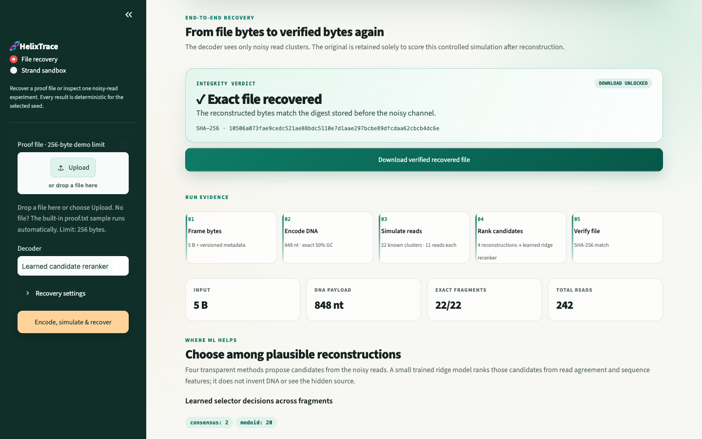
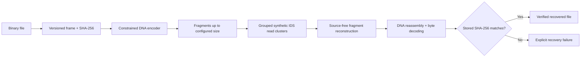

# HelixTrace - ML Assist For Synthetic DNA

**ML-assisted recovery for future DNA archives.**

**Live demo:** https://helixtrace.streamlit.app

**Demo video:** https://youtu.be/-ZeMx-drbGg

Some files are used every day. Others are meant to outlive the hardware they sit on: film and image
masters, scientific datasets, cultural collections, and institutional records. Synthetic DNA is
being researched as a future medium for this kind of cold archive because information density,
long-term stability, and potentially low energy at rest can matter more than instant access.

HelixTrace explores one difficult recovery layer in that future system: **reliable readback**. It
takes a small binary file through a controlled DNA-storage path—encoding, fragmentation, synthetic
insertion, deletion, and substitution reads, deterministic reconstruction, selection among four
reconstruction candidates by a small trained ridge reranker, byte decoding, and embedded SHA-256
verification. The reconstructor receives only the noisy read clusters. It releases a file only when
the recovered payload matches the digest embedded before the channel. A plausible-looking near miss
is reported as failure, not success.

This is a free, open-source **Developer Tools** prototype for testing DNA-storage reconstruction
ideas. The public app needs no account, API key, credits, or paid service.

> **Scope:** HelixTrace is a controlled synthetic test bench for small files—not a production DNA
> storage system or a claim about wet-lab sequencing performance.



The browser-verified built-in proof (seed 43) uses the learned candidate selector to send 5 bytes
through 22 fragment clusters and 242 noisy reads; all 22 fragments recover exactly, the file
SHA-256 matches, and the verified download is enabled. This single run is a product smoke test, not
a recovery-rate estimate.

## Why DNA archives?

DNA is not a replacement for cloud storage, SSDs, or magnetic tape today. Its most credible early
role is **cold data**: information written rarely and preserved for decades or longer. Research has
demonstrated large-scale DNA storage and retrieval, while reviews identify exceptional theoretical
density, potentially long lifetimes, and the prospect of low energy at rest as the medium's
attraction.

The trade-offs are equally important. DNA synthesis remains expensive and slow; sequencing has
latency and errors; rewriting is difficult; and a complete system still needs addressing,
clustering, error correction, and physical validation. HelixTrace does not pretend those problems
are solved. It focuses on reconstructing the original file from imperfect observations and refusing
to return an unverified result.

- [DNA stability and storage-system trade-offs — Nature Communications](https://www.nature.com/articles/s41467-021-21587-5)
- [Random access in large-scale DNA data storage — Nature Biotechnology](https://www.nature.com/articles/nbt.4079)
- [Low-cost synthesis with reconstruction and error correction — Nature Communications](https://www.nature.com/articles/s41467-020-19148-3)

## What you can test

The end-to-end workflow accepts any small binary payload, such as text, an image, or a compact data
file, and preserves its filename and media type. The public app caps uploads at 256 bytes so the
multi-alignment demo stays responsive; the reusable framing codec has a 4 MiB safety limit. One
seeded run:

1. frames the bytes with length, metadata, and cryptographic integrity fields;
2. encodes the frame as DNA with the constrained storage codec;
3. splits it into source fragments up to a configurable size;
4. generates a grouped cluster of variable-length IDS reads for each fragment;
5. reconstructs every fragment with a fixed decoder or the learned candidate selector, without
   giving either one the source sequence;
6. joins the reconstructed DNA, decodes the bytes, and verifies the stored SHA-256.

Success is deliberately strict. A plausible-looking sequence or readable partial file is not
reported as verified recovery if even one byte changes.



The simulator retains the original only to measure experimental accuracy. It is not passed to
`reconstruct_fragment` or the underlying trace-cluster decoder.

## Storage codec

HelixTrace separates reversible digital framing from trace reconstruction. The frame records a
format version, optional UTF-8 filename and media type, payload length, payload SHA-256, and a second
digest over the preceding header, metadata, and payload.

The main recovery path uses `constrained-1bit-v1`, a deterministic state-dependent code with these
guarantees:

| Property | Constrained storage codec | Dense low-level codec |
|---|---:|---:|
| Information density | 1 bit/nt | 2 bits/nt |
| GC content | Exactly 50% | Not constrained |
| Maximum homopolymer | 1 | Not constrained |
| Role | Default file-recovery path | Reversible codec utility |

The constrained guarantees cost twice as many nucleotides as the direct base-4 mapping. They are
sequence-design properties, not error-correcting redundancy. SHA-256 detects a wrong result but does
not repair it.

The lower-level codec also provides versioned self-indexing oligo containers with per-oligo tags,
duplicate/missing-index checks, and order-independent reassembly. The controlled noisy-read runner
does not yet solve clustering or demultiplexing: read-cluster identity and fragment order are kept as
out-of-band metadata.

## Reconstruction engine

For every read cluster, HelixTrace can build transparent candidates from only the observed reads:

- an observed trace medoid;
- iterative, gap-aware global-alignment consensus;
- equal-budget evidence-only local refinement; and
- biology-aware local refinement with soft GC and homopolymer penalties.

The file API exposes all four deterministic decoders plus a `learned` option. The learned path generates the
same four candidates, selects one per fragment, and records the selected method and model version in
the result. The Python API defaults to a 64-nt fragment cap and consensus. The live app's default
learned run uses a 40-nt cap and one local-search step to stay responsive; selecting a fixed decoder
uses the 64-nt cap.

Insertions and deletions are aligned before voting; raw positions are never assumed to match. The
biology-aware candidate is an inference-time search, not a trained neural model. In controlled
experiments the source generates the synthetic traces; after that generation step, reconstruction
receives only the traces, and ground truth is consulted again only to calculate evaluation metrics.

### Learned candidate reranker

HelixTrace also includes `helixtrace-linear-reranker-v1`, a small supervised ridge model that ranks
the four deterministic candidates. It does not generate bases. At inference it sees only the noisy
traces and candidate-level features: read-evidence costs, lengths, candidate disagreement, GC and
homopolymer summaries, trace disagreement, cluster size, and method identity. The known source was
used only offline to create training targets.

The committed model was trained on 80 seeded synthetic experiments and evaluated on 120 experiments
from a disjoint master seed. The held-out distribution covers lengths 40/60/80, cluster sizes
3/5/7/10, and symmetric per-event IDS probabilities from 0.02 to 0.07.

| Held-out selector | Mean edit distance | Mean NED | Exact recovery |
|---|---:|---:|---:|
| Alignment consensus | 2.2500 | 0.035646 | 34.17% |
| Evidence-only refinement | 2.0000 | 0.031628 | 35.00% |
| Biology-aware refinement | 2.0000 | 0.031767 | 35.00% |
| **Learned reranker** | **1.9917** | **0.031524** | **35.00%** |
| Candidate oracle (unavailable at inference) | 1.9583 | 0.031038 | 35.00% |

The learned gain over the strongest fixed candidate is deliberately not oversold: it reduced mean
NED by 0.33% relative and removed one edit across all 120 held-out experiments; exact recovery did
not change. It shows that a trained selector with source-free inference is measurable, not that it
generalizes to wet-lab data. It also cannot repair an error absent from all four candidates. The
weights are dependency-free and reviewable in
[`learned_reranker.py`](src/dna_trace_reconstruction/learned_reranker.py);
the exact split and results are recorded in the
[versioned provenance artifact](src/dna_trace_reconstruction/data/learned_reranker_v1.json) and can
be regenerated with [`train_reranker.py`](scripts/train_reranker.py).

These held-out metrics evaluate strand candidates with three local-search steps. They are separate
from the faster 40-nt-cap, one-step configuration used by the interactive demo's default learned
run.

## Separate end-to-end file benchmark · consensus only

Separately from the learned-reranker evaluation above, the committed file benchmark runs 48
deterministic random 16-byte binary payloads through the constrained encoder and the fixed consensus
decoder. It does not evaluate the learned selector. Each condition contains 12 files; the fragment
cap is 64 nt, and insertion, deletion, and substitution each receive the listed per-event
probability.

| Reads/fragment | Probability for each IDS event | Full files with SHA match | Exact fragments | Mean fragment NED |
|---:|---:|---:|---:|---:|
| 7 | 0.01 | 11/12 (91.7%) | 203/204 (99.5%) | 0.0000766 |
| 7 | 0.02 | 2/12 (16.7%) | 186/204 (91.2%) | 0.0016792 |
| 11 | 0.01 | **12/12 (100%)** | **204/204 (100%)** | **0.0000000** |
| 11 | 0.02 | 9/12 (75.0%) | 201/204 (98.5%) | 0.0003064 |
| **Overall** | — | **34/48 (70.8%)** | **794/816 (97.3%)** | **0.0005155** |

The gap between 97.3% exact fragments and 70.8% complete files is the point: one wrong fragment is
enough to fail whole-file verification. More reads helped in these conditions, while doubling each
IDS probability sharply reduced success. The study is descriptive, synthetic, and consensus-only;
it is not a comparison with the learned selector or evidence of wet-lab performance. Read clusters
and fragment order are supplied out of band.

See the committed [JSON report](artifacts/file_recovery_benchmark.json),
[per-file CSV](artifacts/file_recovery_benchmark.csv), and reproducible
[`run_file_benchmark.py`](scripts/run_file_benchmark.py).

### Contract smoke tests

The automated suite covers the product contract directly. These are deterministic smoke tests, not
a file-recovery-rate benchmark:

| Case | Channel and decoder | Verified outcome |
|---|---|---|
| 20-byte `DNA storage recovery` payload | 1% insertion + 1% deletion + 1% substitution, 11 reads/fragment, seed 42, consensus | Original bytes recovered; SHA-256 matched |
| 2-byte `ML` payload | Same noisy channel, 40-nt fragment cap, one search step, learned selector | Original bytes recovered; SHA-256 matched; model version recorded |
| High-noise negative control | 45% deletion + 45% substitution, one read/fragment, seed 7, medoid | Integrity failure reported; no recovered bytes exposed |

A zero-noise test separately round-trips non-text bytes including `0x00` and `0xff`, filename, and
media type. Passing these cases proves the implemented path and its failure behavior; it does not
estimate performance across arbitrary files or real sequencing channels.

## Deterministic strand benchmark

The committed baseline benchmark remains a scientific guardrail for the new file workflow. It
contains 120 constraint-compliant experiments: 60-nt sources, 20 samples in each combination of
cluster size `3/5/10` and symmetric per-event IDS probability `0.03/0.06`. Every method receives the
same trace clusters.

| Method | Exact recovery | Mean normalized edit distance | Biologically valid outputs |
|---|---:|---:|---:|
| Observed trace medoid | 1.7% | 0.08948 | 64.2% |
| Alignment consensus | 27.5% | 0.04430 | 80.8% |
| Evidence-only local search | **32.5%** | 0.03669 | 85.0% |
| Biology-aware local search | **32.5%** | **0.03657** | **100.0%** |

The 20-source GC negative control is essential: evidence-only search achieved 55% exact recovery,
while biology-aware search achieved 0%. The prior helps validity when the encoder guarantees the
assumption, but can systematically move reconstruction away from the truth when that assumption is
false. These small descriptive results are not a claim of statistical significance or
state-of-the-art performance. See the [benchmark report](docs/benchmark.md) and
[long-form results](artifacts/benchmark_rows.csv).

## Quick start

HelixTrace supports macOS, Linux, and Windows with Python 3.11 or newer.

```bash
git clone https://github.com/772q5xpjpx-alt/helixtrace.git
cd helixtrace
python3 -m venv venv
source venv/bin/activate
python -m pip install --upgrade pip
python -m pip install -r requirements.txt
streamlit run app.py
```

On Windows PowerShell, activate the environment with `venv\Scripts\Activate.ps1`.

The public demo and local default path are complete without OpenAI API access.

### Run file recovery from Python

```python
from dna_trace_reconstruction.file_pipeline import run_file_recovery

result = run_file_recovery(
    b"ML",
    filename="sample.bin",
    media_type="application/octet-stream",
    decoder="learned",
    fragment_bases=40,
    local_search_steps=1,
    seed=42,
)

assert result.checksum_verified
assert result.recovered_data == b"ML"
```

This exact seeded noisy-channel case is covered by the automated suite. Other noise settings can
legitimately return `checksum_verified=False`; that closed failure is part of the contract.

### Recover a file from the CLI

```bash
python -c "from pathlib import Path; Path('sample.bin').write_bytes(b'HELIX')"
helixtrace \
  --input-file sample.bin \
  --output-file recovered.bin \
  --file-decoder learned \
  --fragment-bases 40 \
  --cluster-size 3 \
  --insertion-probability 0 \
  --deletion-probability 0 \
  --substitution-probability 0 \
  --seed 42
```

This zero-noise command is the shortest guaranteed codec/reassembly check; increase the three IDS
probabilities to test reconstruction. The CLI exits with failure and does not write `recovered.bin`
unless the decoded payload passes verification.

### Run the deterministic strand experiment from the CLI

```bash
helixtrace \
  --sequence ACGTACGTACGT \
  --cluster-size 5 \
  --insertion-probability 0.08 \
  --deletion-probability 0.08 \
  --substitution-probability 0.08 \
  --seed 42
```

### Reproduce the committed baseline

```bash
python scripts/run_benchmark.py \
  --samples-per-cell 20 \
  --sequence-length 60 \
  --seed 20260720 \
  --output-dir artifacts
```

Regenerate the learned-reranker training and held-out report:

```bash
python scripts/train_reranker.py --output artifacts/learned_reranker_report.json
```

Reproduce the submitted end-to-end file benchmark:

```bash
python scripts/run_file_benchmark.py
```

### Run the verification suite

The submitted suite contains **151 passing tests** across codecs, file recovery, source-free
reconstruction, the learned reranker and its artifact, the Streamlit product, CLI, metrics, channel,
constraints, and legacy pipeline.

```bash
python -m pip install -e ".[dev]"
pytest -q
ruff check .
ruff format --check .
```

### Optional GPT-5.6 experiment analyst

Reconstruction, verification, and the free guided interpretation are local and deterministic. A
maintainer may separately enable the optional Responses API analyst:

```bash
python -m pip install -e ".[ai]"
export OPENAI_API_KEY="your-key-here"
streamlit run app.py
```

The analyst receives only a bounded JSON summary of already computed strand-experiment metrics. It
does not reconstruct sequences, calculate success, or turn the deterministic baseline into a neural
model. This code path is mock-tested; the repository does not claim that a live API call occurred.

## What this prototype does not solve

- **Synthetic channel only:** there is no wet-lab synthesis, PCR, Illumina, or nanopore dataset in
  the submitted evaluation.
- **Small files only:** the public UI intentionally caps uploads at 256 bytes; the framing codec has
  a 4 MiB safety limit, but each fragment still requires multiple alignments.
- **Clusters and order supplied:** reads are already grouped by source fragment and fragment order
  is retained out-of-band. There is no clustering, addressing, or demultiplexing stage.
- **No production storage stack:** there are no primers, adapters, barcodes, molecular addressing,
  strand-loss model, PCR-bias model, secondary-structure model, or synthesis workflow.
- **No error-correcting code:** framing digests and per-oligo tags detect corruption; they are not
  Reed-Solomon, fountain, convolutional, or other ECC and cannot recover missing fragments.
- **No real-noise claim:** categorical per-event IDS probabilities are not interchangeable with
  empirical per-base sequencing error rates.
- **No SOTA claim:** the current methods and benchmark are transparent baselines for further work,
  not a like-for-like comparison with coded systems such as TrellisBMA or neural systems trained on
  real reads.
- **Small learned selector, not a neural decoder:** the ridge reranker chooses among existing
  candidates. Its one held-out split showed a one-edit aggregate gain and no exact-recovery gain.

## Build Week scope and Codex collaboration

The project began as a small personal research scaffold on **July 10, 2026**, before the OpenAI Build
Week submission period. Only the meaningful extensions built after the submission period opened are
entered for judging.

| Before Build Week | Added during Build Week |
|---|---|
| Research notes and the broad reconstruction question | Explicit product scope, claims, failure criteria, and limitations |
| Categorical IDS simulator and seeded trace generation | Source-free medoid, global alignment, iterative consensus, and matched local searches |
| Initial CLI and simulator tests | Metrics, controlled strand benchmark, negative control, and committed artifacts |
| IDS channel semantics note | File framing, reversible codecs, constrained DNA encoding, fragmentation, and SHA-256 verification |
| — | End-to-end file-recovery pipeline and interactive Streamlit workflow |
| — | Reproducible 48-file end-to-end benchmark with committed JSON and per-file CSV |
| — | Trained linear candidate reranker, disjoint held-out evaluation, and versioned provenance artifact |
| — | Optional GPT-5.6 Responses API analyst with bounded evidence |
| — | Expanded 151-test suite, browser QA, public deployment, and submission materials |

Codex, powered by GPT-5.6 Sol for the main development task, was the primary engineering
collaborator. It audited the scaffold and official rules, split independent implementation and
review work, implemented and tested the reconstruction layers, challenged the biological-prior
claim with a negative control, built the reproducible benchmark, added the file codec and recovery
path, exercised the application in a real browser, and prepared the public deployment and
documentation.

Codex accelerated implementation and verification, but the product decisions remained explicit:
recover actual bytes rather than stop at an educational visualization; keep the source out of the
decoder; require a cryptographic check before claiming success; compare biological constraints
against an equal-budget control; preserve a failing negative control; and disclose the missing
wet-lab and production-storage layers.

The verified GPT-5.6 use for the submission is GPT-5.6 Sol through Codex. The optional Responses API
analyst in [`ai_analyst.py`](src/dna_trace_reconstruction/ai_analyst.py) is a separate integration,
not the evidence for that development claim.

## Repository map

```text
.
├── app.py                              # Free interactive Streamlit product
├── src/dna_trace_reconstruction/
│   ├── file_codec.py                   # Binary framing, DNA codecs, integrity checks
│   ├── file_pipeline.py                # Source-free end-to-end file recovery
│   ├── ids_channel.py                  # Validated categorical IDS simulator
│   ├── reconstruction.py               # Alignment, medoid, and consensus
│   ├── constraints.py                  # Biological metrics and matched searches
│   ├── learned_reranker.py             # Trained source-free candidate selector
│   ├── metrics.py                      # Levenshtein metrics
│   ├── pipeline.py                     # Strand experiment orchestration
│   ├── source_design.py                # Controlled source generator
│   └── ai_analyst.py                   # Optional GPT-5.6 interpretation
├── scripts/run_benchmark.py            # Deterministic strand benchmark
├── scripts/run_file_benchmark.py       # End-to-end file recovery benchmark
├── scripts/train_reranker.py           # Reproduce reranker weights and evaluation
├── artifacts/                          # Strand and end-to-end file benchmark results
├── tests/                              # Unit and integration tests
├── docs/                               # Channel semantics and benchmark report
├── SUBMISSION.md                       # Ready-to-paste hackathon copy
├── DEMO_SCRIPT.md                      # Under-three-minute recording script
└── HACKATHON_CHECKLIST.md              # Final delivery checklist
```

## Roadmap

1. Expand the file benchmark across payload sizes, asymmetric channel settings, and all decoders.
2. Add explicit address design, demultiplexing, fragment-loss simulation, and a documented ECC
   layer.
3. Evaluate reconstruction on a real clustered nanopore dataset and calibrate the channel from
   empirical reads.
4. Compare appropriate uncoded and coded baselines on identical splits.
5. Train and validate a compact neural sequence reconstructor while retaining the deterministic
   methods as controls. Compare a cross-entropy-only control with the same model augmented by
   differentiable GC and homopolymer penalties across a `lambda` sweep, reporting both
   reconstruction accuracy and biological constraint-violation rates.

## License

Released under the [MIT License](LICENSE).

The core runtime dependency is
[Streamlit](https://github.com/streamlit/streamlit), distributed under the Apache-2.0 license. The
[OpenAI Python SDK](https://github.com/openai/openai-python) is confined to the optional `ai` extra.
The interface uses original CSS and system fonts; no third-party media assets are bundled. See
[third-party notices](THIRD_PARTY_NOTICES.md).
